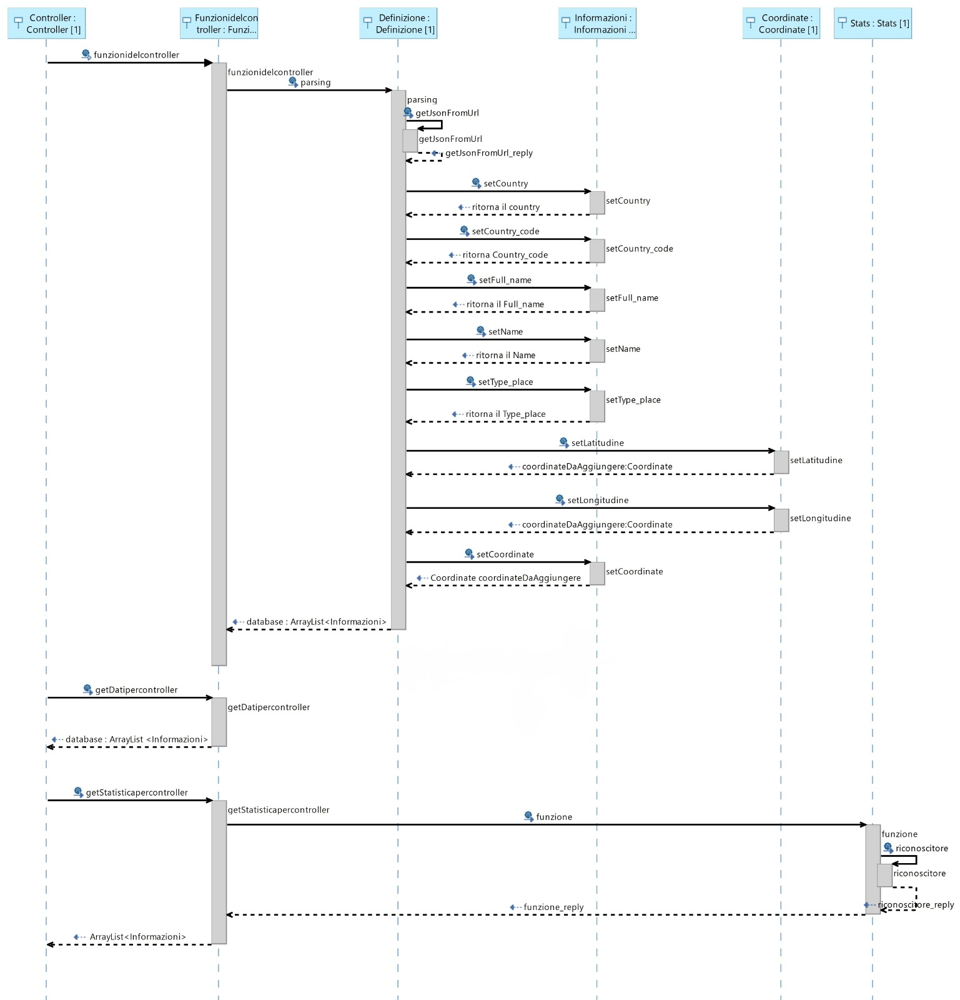

# Progetto di programmazione 2020
Progetto per l’esame di “Programmazione ad oggetti” del Corso di Ingegneria Informatica e dell’Automazione dell’Università politecnica delle Marche, anno accademico 2019/2020. 

## Indice:
* [Introduzione](#Introduzione)
* [Struttura](#Struttura)
* [Chiamate](#Chiamate)
* [Funzionamento](#Funzionamento)
* [Classi](#Classi)
* [Eccezioni](#Eccezioni)
* [Metadata](#Metadata)
* [Tecnologie](#Tecnologie)
* [Autore](#Autore)

## Introduzione
L’applicazione progettata ha lo scopo di mostrare le funzionalità di ricerca basata su parametri geografici e delle statistiche sulle location ottenute in base all’area di richiesta in termini di query geografica. L’utente per lanciare l’applicazione deve utilizzare un Client come Postman per poter effettuare delle richieste e visualizzare dei dati.

## Struttura 
Il diagramma del caso d’uso mostra come l’utente può interagire con il programma.

## Chiamate
Per effettuare delle richieste l’utente può consultare la tabella che mostra le varie istruzioni per visualizzare i dati interessati :
| ROTTA | METODO | DESCRIZIONE | BODY |
|---------- | ------------ | ------------------ | --------------------------------------------- |
| /dati | GET | L’utente ha la possibilità di visualizzare una lista di località |  |
| /statistica | POST | L’utente ha la possibilità di ottenere una lista di località nell’area di ricerca da lui desiderata| coppie di coordinate in formato JSON |
| /metadata | GET | L’utente ha la possibilità di richiedere le informazioni su come poter analizzare i dati |  |

Il formato JSON utilizzato dall’utente, con le coppie di coordinate, deve essere inserito in questa forma : 
 
{
 
“Angolo_alto_sinistra”:

                               [

                                        Num1

                                        Num2

                                                    ]

“Angolo_basso_destra”:

                                   [

                                           Num3

                                           Num4

                                                        ]

}

Se l’utente non scrive bene la richiesta viene restituito un messaggio di errore.
Ad esempio:

{ “angolo_alto_sinistra”:

[

127,

32,

             ]

“angolo_basso_destra”: 

[

56,

69

          ]

}

## Funzionamento
In questo diagramma viene mostrato come interagiscono tra di loro gli oggetti delle varie classi e la loro sequenza temporale, poiché all’interno del diagramma le chiamate vengono disposte in base all’ordine cronologico.

## Classi
Questo diagramma mostra come sono stati divisi i vari packages. 

### Controller
E’ la classe che gestisce le chiamate dell’interfaccia, che si trova in nell’omonimo package;

### FunzionidelController 
E’ la classe che effettua un’estensione di controller;
### Definizione 
Avviene il download e il salvataggio di tutte le informazioni in un determinato ArrayList;
### Informazioni
Al suo interno sono presenti tutti i “nomi” relativi hai determinati paesi e le relative coordinate associati a quest’ultimi.
### Coordinate 
All’interno troviamo le variabili delle coordinate con la latitudine e la longitudine;
### Stats
La classe gestisce le informazioni in maniera tale che si crei un’area di ricerca in termini di query geografica in base alle informazioni che vengono passate attraverso un Client ad esempio Postman.
### StatsInterfaccia
E’ la classe interfaccia che definisce tutte le funzioni che poi verranno usate nella classe Stats.

## Eccezioni
Per la gestione delle eccezioni vengono utilizzate la classe “eccezzioniEsterne” e la classe “eccezzioniInterne”. Quelle interne sono dovute ad errori di lettura, file non trovati, etc..; invece quelle esterne sono utilizzate per un inserimento non corretto delle coordinate. Nel caso di un’eccezione esterna abbiamo la presenza di un controller (“Erroremostrato”) per spiegare all’utente dovesi si trova l’errore e quindi la possibilità di una correzione mirata da parte di quest’ultimo.

## Metadata
Questa classe importa le informazioni relative alle variabili da un file di testo. Il file di testo rinominato “informazioni.txt” contiene in ogni linea il nome della variabile, il significato e il tipo della variabile. I metadati vengono creati mediante il costruttore della omonima classe, gestito tramite @Autowired, ed è possibile richiedere i dati immagazzinati inizialmente ogni volta che si richiede la giusta rotta “/metadata”.

## Tecnologie
Eclipse

SpringBoot

Maven

## Autore
Bandello Antonio

